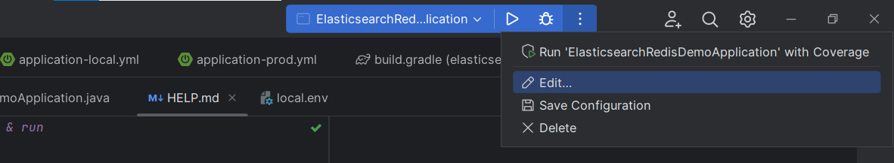
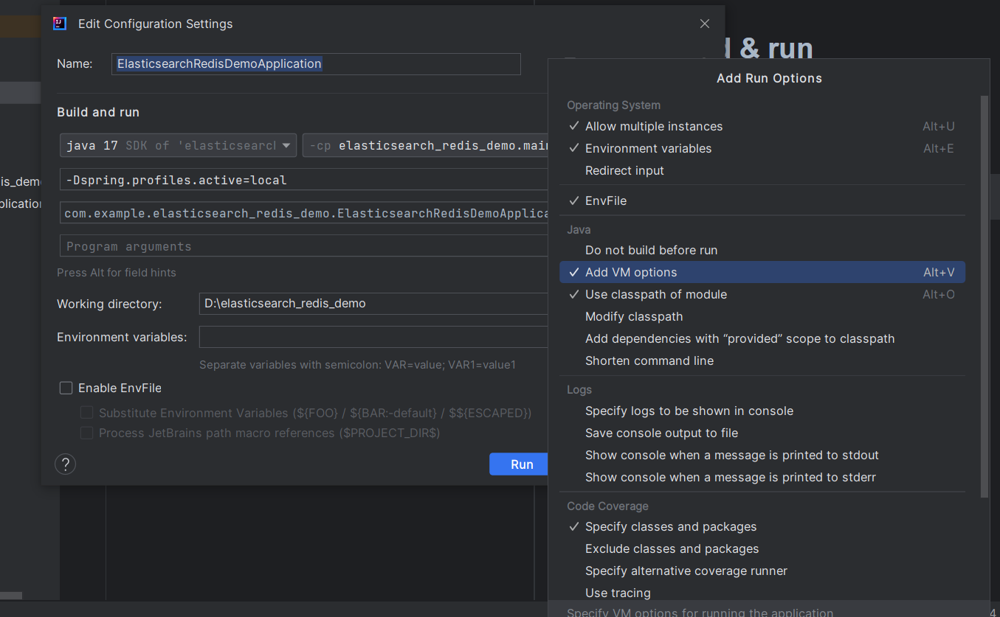
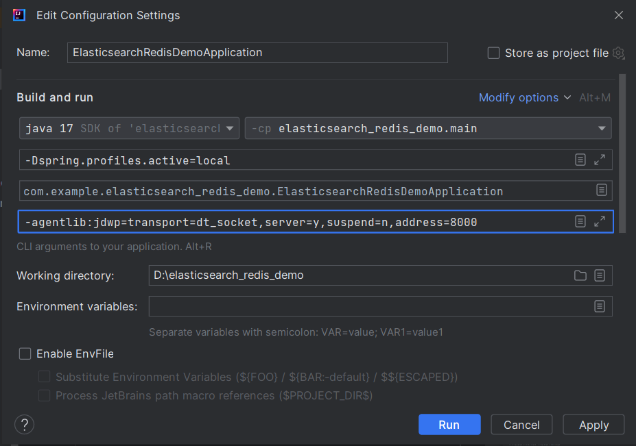

# How to build & run

There are 2 profile config
* `local` with port `9090`
* `prod` with port `8080`

Add this VM option to Run Config 
``` 
-Dspring.profiles.active=<local/prod -> yourchoice>
```




* If you want to run debug add this to `Program arguments`

```
-agentlib:jdwp=transport=dt_socket,server=y,suspend=n,address=8000
```



